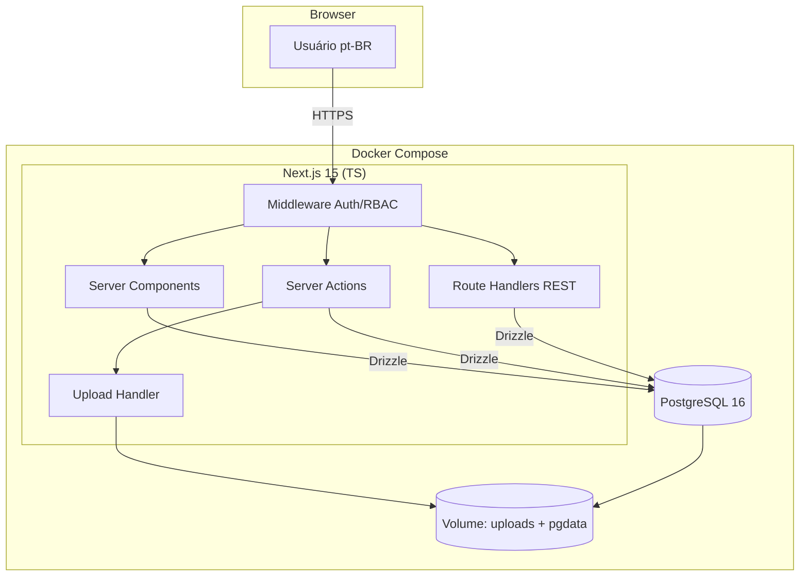
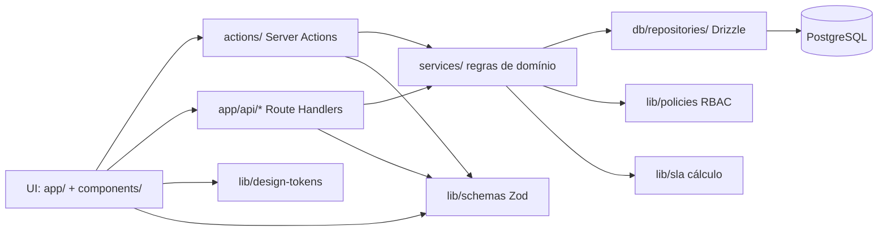
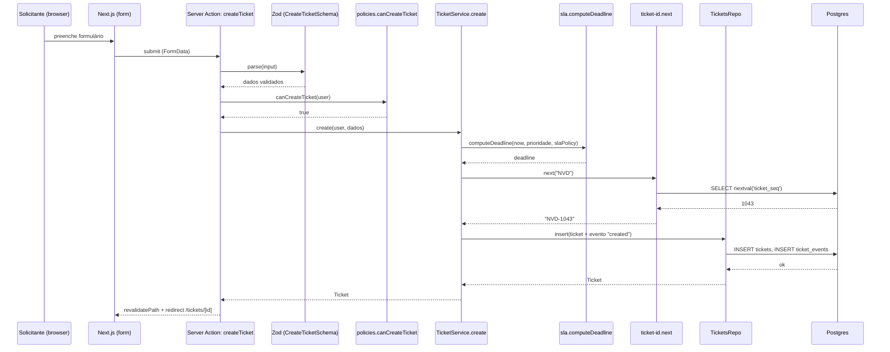
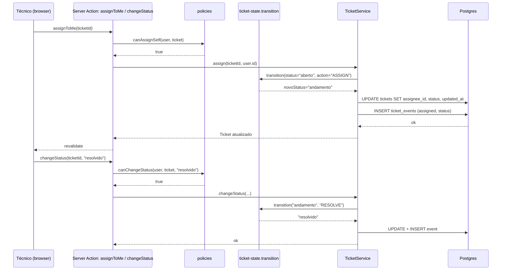
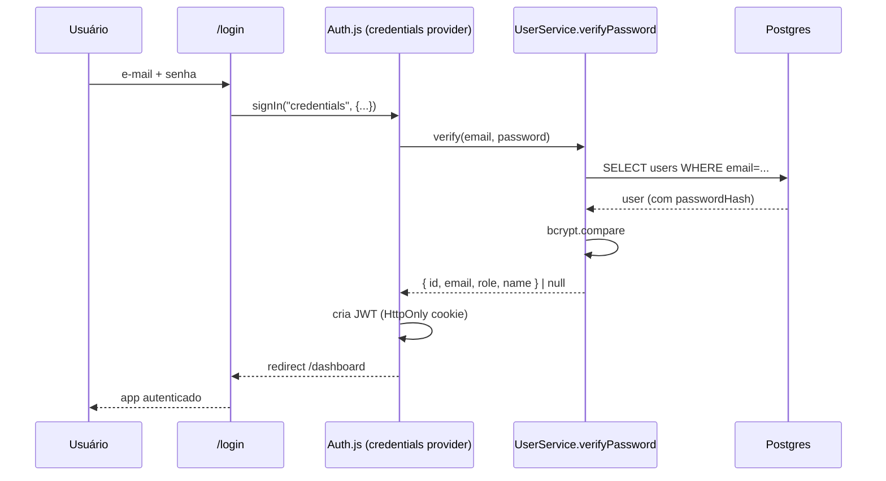
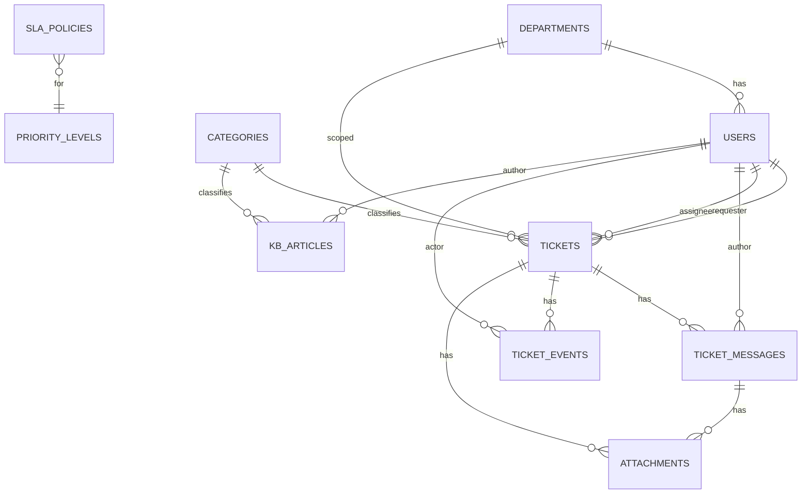

# Documento de Design: NaveDesk — Central de TI

## Overview

O **NaveDesk** é um sistema interno de chamados (helpdesk) para o time de TI da Contábil Andrade. Ele permite que colaboradores (solicitantes) abram chamados, que técnicos de TI atendam e resolvam esses chamados respeitando prazos de SLA por prioridade, e que administradores configurem o sistema (usuários, SLAs, categorias, integrações). O produto é em **pt-BR**, segue uma estética visual já definida nas mockups (paleta índigo `#5E5CE6`, tipografia Geist, cantos arredondados, sombras suaves) e tem três papéis: **Solicitante**, **Técnico TI** e **Admin**.

A solução é construída como um app **Next.js 15 (App Router) em TypeScript**, com **PostgreSQL 16** como banco, **Drizzle ORM** para schema/migrations, **Auth.js v5** para autenticação por credenciais com RBAC, **Tailwind v4 + shadcn/ui** como base de componentes (customizados para a paleta índigo) e **Docker Compose** orquestrando app + banco. O foco do desenho é em **fundação reutilizável**: design tokens centralizados, componentes atômicos tipados (Button, Badge, StatusBadge, PriorityPill, KpiCard, DataTable, etc.) e camadas claras (UI → ações de servidor → serviço de domínio → repositório/Drizzle → Postgres).

A intenção é que o usuário possa clonar o repositório em qualquer máquina, rodar `docker compose up`, e ter o sistema funcionando com banco semeado. Toda configuração sensível fica em `.env` (com `.env.example` versionado), e migrations são executadas automaticamente na subida do contêiner do app.

---

## Architecture

### Diagrama de alto nível



### Camadas internas



**Princípios:**
- **UI nunca toca o banco direto.** Server Components leem via funções `services/*` (read-only); mutações vão por Server Actions ou Route Handlers que chamam `services/*` (write).
- **Validação Zod na borda.** Toda entrada (form, API) é validada antes de chegar ao serviço.
- **RBAC declarativo.** `lib/policies` exporta funções `canX(user, resource): boolean` puras; serviços chamam as policies.
- **SLA puro.** `lib/sla` contém funções puras (sem efeitos) para calcular deadline, tempo restante, status (`ok` | `warn` | `crit` | `breached`). Testáveis com PBT.

### Estrutura de pastas

```
navedesk/
├── docker-compose.yml
├── docker-compose.dev.yml
├── Dockerfile
├── .env.example
├── .dockerignore
├── README.md
├── package.json
├── tsconfig.json
├── next.config.ts
├── tailwind.config.ts
├── drizzle.config.ts
├── public/
│   └── uploads/                  # volume montado (gitignored)
├── src/
│   ├── app/
│   │   ├── layout.tsx
│   │   ├── globals.css           # importa tokens
│   │   ├── (auth)/
│   │   │   └── login/page.tsx
│   │   ├── (app)/                # área autenticada
│   │   │   ├── layout.tsx        # Sidebar + Topbar
│   │   │   ├── dashboard/page.tsx
│   │   │   ├── tickets/
│   │   │   │   ├── page.tsx              # lista
│   │   │   │   ├── novo/page.tsx
│   │   │   │   ├── atribuidos/page.tsx
│   │   │   │   └── [id]/page.tsx         # detalhe
│   │   │   ├── kb/                       # base de conhecimento
│   │   │   │   ├── page.tsx
│   │   │   │   ├── [slug]/page.tsx
│   │   │   │   └── novo/page.tsx
│   │   │   ├── perfil/page.tsx
│   │   │   └── admin/
│   │   │       ├── usuarios/page.tsx
│   │   │       ├── sla/page.tsx
│   │   │       ├── categorias/page.tsx
│   │   │       └── geral/page.tsx
│   │   └── api/
│   │       ├── auth/[...nextauth]/route.ts
│   │       ├── uploads/route.ts          # POST anexo
│   │       └── uploads/[id]/route.ts     # GET anexo
│   ├── components/
│   │   ├── ui/                   # primitivos (shadcn-style)
│   │   │   ├── button.tsx
│   │   │   ├── input.tsx
│   │   │   ├── select.tsx
│   │   │   ├── textarea.tsx
│   │   │   ├── badge.tsx
│   │   │   ├── card.tsx
│   │   │   ├── dialog.tsx
│   │   │   ├── dropdown.tsx
│   │   │   ├── tabs.tsx
│   │   │   ├── toast.tsx
│   │   │   ├── avatar.tsx
│   │   │   ├── data-table.tsx
│   │   │   ├── empty-state.tsx
│   │   │   └── kbd.tsx
│   │   ├── domain/               # componentes de domínio
│   │   │   ├── status-badge.tsx
│   │   │   ├── priority-pill.tsx
│   │   │   ├── category-chip.tsx
│   │   │   ├── sla-meter.tsx
│   │   │   ├── kpi-card.tsx
│   │   │   ├── ticket-row.tsx
│   │   │   ├── ticket-conversation.tsx
│   │   │   ├── ticket-history.tsx
│   │   │   ├── ticket-form.tsx
│   │   │   └── attachment-chip.tsx
│   │   └── layout/
│   │       ├── sidebar.tsx
│   │       ├── topbar.tsx
│   │       └── page-header.tsx
│   ├── actions/                  # Server Actions
│   │   ├── tickets.ts
│   │   ├── messages.ts
│   │   ├── users.ts
│   │   ├── kb.ts
│   │   └── admin.ts
│   ├── services/                 # regras de domínio
│   │   ├── tickets.service.ts
│   │   ├── users.service.ts
│   │   ├── kb.service.ts
│   │   └── stats.service.ts
│   ├── db/
│   │   ├── client.ts             # drizzle + pg pool
│   │   ├── schema.ts             # tabelas Drizzle
│   │   ├── migrations/           # gerado por drizzle-kit
│   │   ├── seed.ts
│   │   └── repositories/
│   │       ├── tickets.repo.ts
│   │       ├── users.repo.ts
│   │       └── kb.repo.ts
│   ├── lib/
│   │   ├── auth.ts               # Auth.js config
│   │   ├── policies.ts           # RBAC puro
│   │   ├── sla.ts                # cálculo de SLA puro
│   │   ├── ticket-state.ts       # máquina de estados pura
│   │   ├── ticket-id.ts          # geração NVD-XXXX
│   │   ├── schemas.ts            # Zod schemas compartilhados
│   │   ├── format.ts             # relTime, fmtDate, fmtDuration
│   │   ├── design-tokens.ts      # exporta tokens em TS
│   │   └── constants.ts          # CATEGORIES, DEPARTMENTS, PRIORITIES, STATUSES
│   ├── styles/
│   │   └── tokens.css            # CSS custom properties (paleta índigo)
│   └── types/
│       └── domain.ts             # tipos compartilhados
└── tests/
    ├── unit/
    ├── pbt/                      # property-based tests
    └── e2e/
```

---

## Diagramas de Sequência

### Fluxo: criação de ticket pelo solicitante



### Fluxo: técnico assumindo e resolvendo ticket



### Fluxo: login (Auth.js Credentials)



---

## Components and Interfaces

### Componentes de UI (camada `components/ui/`)

Todos os componentes seguem o padrão shadcn/ui: arquivos locais, exportam um React component + suas variantes via `cva` (class-variance-authority), aceitam `className` para extensão e `asChild` quando faz sentido. Tipados com TS estrito.

```ts
// components/ui/button.tsx
type ButtonVariant = "primary" | "default" | "ghost" | "danger";
type ButtonSize = "sm" | "md" | "lg" | "icon";

interface ButtonProps extends React.ButtonHTMLAttributes<HTMLButtonElement> {
  variant?: ButtonVariant;       // default: "default"
  size?: ButtonSize;             // default: "md"
  loading?: boolean;
  icon?: React.ReactNode;
  asChild?: boolean;
}
```

```ts
// components/ui/badge.tsx
type BadgeTone =
  | "indigo" | "blue" | "green" | "amber" | "red" | "grey";

interface BadgeProps extends React.HTMLAttributes<HTMLSpanElement> {
  tone?: BadgeTone;              // default: "grey"
  withDot?: boolean;             // default: true
}
```

```ts
// components/ui/data-table.tsx
interface DataTableColumn<T> {
  id: string;
  header: React.ReactNode;
  width?: number | string;
  cell: (row: T) => React.ReactNode;
  sortKey?: keyof T;
}

interface DataTableProps<T> {
  columns: DataTableColumn<T>[];
  rows: T[];
  rowKey: (row: T) => string;
  onRowClick?: (row: T) => void;
  empty?: React.ReactNode;
  loading?: boolean;
}
```

### Componentes de domínio (camada `components/domain/`)

```ts
// components/domain/status-badge.tsx
type TicketStatus = "aberto" | "andamento" | "aguardando" | "resolvido" | "fechado";
interface StatusBadgeProps { status: TicketStatus; }
// mapping: aberto→blue, andamento→amber, aguardando→grey, resolvido→green, fechado→grey

// components/domain/priority-pill.tsx
type Priority = "baixa" | "media" | "alta" | "critica";
interface PriorityPillProps { priority: Priority; }

// components/domain/sla-meter.tsx
interface SlaMeterProps {
  deadline: Date;
  priority: Priority;
  status: TicketStatus;          // se "fechado" ou "resolvido", renderiza "—"
  /** Tempo de referência. Default: new Date(). */
  now?: Date;
}

// components/domain/kpi-card.tsx
interface KpiCardProps {
  label: string;
  value: string | number;
  unit?: string;
  delta?: { value: number; direction: "up" | "down"; reference: string };
  spark?: number[];
}

// components/domain/ticket-form.tsx
interface TicketFormProps {
  defaults?: Partial<CreateTicketInput>;
  onSubmit: (data: CreateTicketInput) => Promise<void>;
  onCancel: () => void;
  /** Permite ao técnico/admin pré-atribuir. Default: false. */
  allowAssign?: boolean;
}
```

**Responsabilidades dos componentes de domínio:**
- Encapsular o mapeamento `valor de domínio → token visual` num único lugar.
- Garantir que mudanças de paleta ou rótulos só precisem ser feitas em um arquivo.
- Não fazer fetch — recebem dados via props (compatível com Server Components).

### Layout

```ts
// components/layout/sidebar.tsx
interface SidebarProps {
  user: SessionUser;
  counts: { open: number; assigned: number; unassigned: number };
  active: string; // route key
}

// components/layout/topbar.tsx
interface TopbarProps {
  title: string;
  subtitle?: string;
  actions?: React.ReactNode;
}

// components/layout/page-header.tsx
interface PageHeaderProps {
  title: string;
  description?: string;
  actions?: React.ReactNode;
}
```

### Server Actions (camada `actions/`)

```ts
// actions/tickets.ts — todas as funções rodam com "use server"
async function createTicket(input: CreateTicketInput): Promise<ActionResult<Ticket>>;
async function updateTicket(id: string, patch: UpdateTicketInput): Promise<ActionResult<Ticket>>;
async function changeTicketStatus(id: string, next: TicketStatus): Promise<ActionResult<Ticket>>;
async function assignTicket(id: string, assigneeId: string | null): Promise<ActionResult<Ticket>>;
async function assignTicketToMe(id: string): Promise<ActionResult<Ticket>>;
async function rateTicket(id: string, stars: 1 | 2 | 3 | 4 | 5): Promise<ActionResult<Ticket>>;

// actions/messages.ts
async function postMessage(ticketId: string, body: string, isInternal?: boolean):
  Promise<ActionResult<TicketMessage>>;

// actions/admin.ts
async function updateSlaPolicy(priority: Priority, hours: number): Promise<ActionResult<void>>;
async function createUser(input: CreateUserInput): Promise<ActionResult<User>>;
async function deactivateUser(id: string): Promise<ActionResult<void>>;
```

`ActionResult<T>` é um tipo utilitário:

```ts
type ActionResult<T> =
  | { ok: true; data: T }
  | { ok: false; error: { code: string; message: string; field?: string } };
```

### Route Handlers (camada `app/api/`)

- `POST /api/uploads` — recebe `multipart/form-data`, valida MIME e tamanho, persiste em `public/uploads/{yyyy}/{mm}/{uuid}.{ext}`, grava em `attachments`. Retorna `{ id, url, name, size, mime }`.
- `GET /api/uploads/[id]` — verifica `canReadAttachment(user, attachment)` e responde com o arquivo (stream).
- `GET /api/auth/[...nextauth]` — endpoints do Auth.js.

---

## Data Models

### Diagrama ER



### Tabelas (Drizzle / PostgreSQL)

```ts
// db/schema.ts — esboço
import { pgTable, uuid, text, timestamp, integer, boolean, pgEnum, primaryKey, index } from "drizzle-orm/pg-core";

export const roleEnum     = pgEnum("role",     ["solicitante", "tecnico", "admin"]);
export const statusEnum   = pgEnum("ticket_status", ["aberto", "andamento", "aguardando", "resolvido", "fechado"]);
export const priorityEnum = pgEnum("priority", ["baixa", "media", "alta", "critica"]);
export const eventTypeEnum = pgEnum("event_type",
  ["created", "status_changed", "priority_changed", "assigned", "unassigned", "rated", "closed"]);

export const departments = pgTable("departments", {
  id:   uuid("id").defaultRandom().primaryKey(),
  name: text("name").notNull().unique(),  // Fiscal, Contabilidade, ...
});

export const categories = pgTable("categories", {
  id:    text("id").primaryKey(),         // "hardware", "software", "sistema", "rede", "acesso", "email"
  label: text("label").notNull(),
  sub:   text("sub").notNull(),
  icon:  text("icon").notNull(),          // ícone Lucide
  active: boolean("active").notNull().default(true),
});

export const slaPolicies = pgTable("sla_policies", {
  priority: priorityEnum("priority").primaryKey(),
  hours:    integer("hours").notNull(),   // baixa=48, media=24, alta=8, critica=2
  updatedAt: timestamp("updated_at", { withTimezone: true }).notNull().defaultNow(),
});

export const users = pgTable("users", {
  id:           uuid("id").defaultRandom().primaryKey(),
  email:        text("email").notNull().unique(),
  passwordHash: text("password_hash").notNull(),
  name:         text("name").notNull(),
  role:         roleEnum("role").notNull().default("solicitante"),
  departmentId: uuid("department_id").references(() => departments.id),
  avatarColor:  text("avatar_color").notNull().default("#5E5CE6"),
  active:       boolean("active").notNull().default(true),
  createdAt:    timestamp("created_at", { withTimezone: true }).notNull().defaultNow(),
});

export const tickets = pgTable("tickets", {
  id:            text("id").primaryKey(),                  // "NVD-1043"
  title:         text("title").notNull(),
  description:   text("description").notNull(),
  status:        statusEnum("status").notNull().default("aberto"),
  priority:      priorityEnum("priority").notNull().default("media"),
  categoryId:    text("category_id").notNull().references(() => categories.id),
  departmentId:  uuid("department_id").notNull().references(() => departments.id),
  requesterId:   uuid("requester_id").notNull().references(() => users.id),
  assigneeId:    uuid("assignee_id").references(() => users.id),
  rating:        integer("rating"),                        // 1..5 ou null
  createdAt:     timestamp("created_at",  { withTimezone: true }).notNull().defaultNow(),
  updatedAt:     timestamp("updated_at",  { withTimezone: true }).notNull().defaultNow(),
  slaDeadline:   timestamp("sla_deadline", { withTimezone: true }).notNull(),
  resolvedAt:    timestamp("resolved_at",  { withTimezone: true }),
  closedAt:      timestamp("closed_at",    { withTimezone: true }),
}, (t) => ({
  idxStatus:    index("tickets_status_idx").on(t.status),
  idxAssignee:  index("tickets_assignee_idx").on(t.assigneeId),
  idxRequester: index("tickets_requester_idx").on(t.requesterId),
  idxDeadline:  index("tickets_deadline_idx").on(t.slaDeadline),
}));

export const ticketMessages = pgTable("ticket_messages", {
  id:         uuid("id").defaultRandom().primaryKey(),
  ticketId:   text("ticket_id").notNull().references(() => tickets.id, { onDelete: "cascade" }),
  authorId:   uuid("author_id").notNull().references(() => users.id),
  body:       text("body").notNull(),
  isInternal: boolean("is_internal").notNull().default(false),
  createdAt:  timestamp("created_at", { withTimezone: true }).notNull().defaultNow(),
}, (t) => ({
  idxTicket: index("messages_ticket_idx").on(t.ticketId, t.createdAt),
}));

export const ticketEvents = pgTable("ticket_events", {
  id:        uuid("id").defaultRandom().primaryKey(),
  ticketId:  text("ticket_id").notNull().references(() => tickets.id, { onDelete: "cascade" }),
  type:      eventTypeEnum("type").notNull(),
  actorId:   uuid("actor_id").notNull().references(() => users.id),
  fromValue: text("from_value"),  // status anterior, prioridade anterior, assignee anterior
  toValue:   text("to_value"),    // novo valor (ou rating como "5")
  createdAt: timestamp("created_at", { withTimezone: true }).notNull().defaultNow(),
}, (t) => ({
  idxTicket: index("events_ticket_idx").on(t.ticketId, t.createdAt),
}));

export const attachments = pgTable("attachments", {
  id:         uuid("id").defaultRandom().primaryKey(),
  ticketId:   text("ticket_id").references(() => tickets.id, { onDelete: "cascade" }),
  messageId:  uuid("message_id").references(() => ticketMessages.id, { onDelete: "cascade" }),
  uploaderId: uuid("uploader_id").notNull().references(() => users.id),
  name:       text("name").notNull(),
  mime:       text("mime").notNull(),
  sizeBytes:  integer("size_bytes").notNull(),
  storageKey: text("storage_key").notNull(),  // ex: "2025/01/uuid.png"
  createdAt:  timestamp("created_at", { withTimezone: true }).notNull().defaultNow(),
});

export const kbCategories = pgTable("kb_categories", {
  id:    text("id").primaryKey(),
  label: text("label").notNull(),
  icon:  text("icon").notNull(),
});

export const kbArticles = pgTable("kb_articles", {
  id:          uuid("id").defaultRandom().primaryKey(),
  slug:        text("slug").notNull().unique(),
  title:       text("title").notNull(),
  body:        text("body").notNull(),  // markdown
  categoryId:  text("category_id").notNull().references(() => kbCategories.id),
  authorId:    uuid("author_id").notNull().references(() => users.id),
  views:       integer("views").notNull().default(0),
  published:   boolean("published").notNull().default(false),
  createdAt:   timestamp("created_at", { withTimezone: true }).notNull().defaultNow(),
  updatedAt:   timestamp("updated_at", { withTimezone: true }).notNull().defaultNow(),
});

// Sequência para gerar NVD-XXXX
// CREATE SEQUENCE ticket_seq START 1042 INCREMENT 1;
```

### Tipos de domínio TypeScript

```ts
// types/domain.ts
export type Role     = "solicitante" | "tecnico" | "admin";
export type Priority = "baixa" | "media" | "alta" | "critica";
export type TicketStatus = "aberto" | "andamento" | "aguardando" | "resolvido" | "fechado";

export interface Ticket {
  id: string;                      // "NVD-1043"
  title: string;
  description: string;
  status: TicketStatus;
  priority: Priority;
  categoryId: string;
  departmentId: string;
  requesterId: string;
  assigneeId: string | null;
  rating: 1 | 2 | 3 | 4 | 5 | null;
  createdAt: Date;
  updatedAt: Date;
  slaDeadline: Date;
  resolvedAt: Date | null;
  closedAt: Date | null;
}

export interface SessionUser {
  id: string;
  email: string;
  name: string;
  role: Role;
  departmentId: string | null;
}

export interface SlaPolicy { priority: Priority; hours: number; }

export interface SlaInfo {
  level: "ok" | "warn" | "crit" | "breached";
  remainingMs: number;             // negativo se vencido
  pctElapsed: number;              // 0..100
}
```

### Regras de validação (Zod)

```ts
// lib/schemas.ts
export const CreateTicketSchema = z.object({
  title:        z.string().trim().min(5).max(120),
  description:  z.string().trim().min(10).max(2000),
  categoryId:   z.string().min(1),
  priority:     z.enum(["baixa", "media", "alta", "critica"]),
  departmentId: z.string().uuid(),
  attachments:  z.array(z.string().uuid()).max(10).default([]),
});

export const PostMessageSchema = z.object({
  body:       z.string().trim().min(1).max(5000),
  isInternal: z.boolean().default(false),
});

export const UploadConstraints = {
  maxBytes: 25 * 1024 * 1024,
  allowedMime: [
    "image/png", "image/jpeg",
    "application/pdf",
    "application/vnd.openxmlformats-officedocument.spreadsheetml.sheet",
    "text/plain", "text/x-log",
  ] as const,
};
```

---

## Algoritmos com Especificações Formais

### Função 1: `computeSlaDeadline`

```ts
function computeSlaDeadline(now: Date, priority: Priority, slaPolicies: SlaPolicy[]): Date
```

**Pré-condições:**
- `now` é `Date` válido (não `Invalid Date`).
- `priority ∈ {"baixa", "media", "alta", "critica"}`.
- `slaPolicies` contém exatamente uma entrada por prioridade, com `hours > 0`.

**Pós-condições:**
- Retorna um `Date` `d` tal que `d.getTime() === now.getTime() + policy.hours * 3_600_000`, onde `policy` é a entrada de `slaPolicies` cuja `priority` casa com o argumento.
- A função é **pura**: nenhuma chamada a `Date.now()`, nenhum efeito colateral.
- Para o mesmo `(now, priority, slaPolicies)`, sempre retorna o mesmo resultado (determinismo).

**Invariantes de loop:** N/A.

### Função 2: `computeSlaInfo`

```ts
function computeSlaInfo(deadline: Date, priority: Priority, slaPolicies: SlaPolicy[], now: Date): SlaInfo
```

**Pré-condições:**
- `deadline`, `now` são `Date` válidos.
- `priority` casa com alguma `slaPolicies[*].priority`.

**Pós-condições:**
- `remainingMs === deadline.getTime() - now.getTime()`.
- `pctElapsed ∈ [0, 100]`, calculado como `clamp(100 - remainingMs/totalMs * 100, 0, 100)` onde `totalMs = policy.hours * 3_600_000`.
- `level` derivado de:
  - `remainingMs ≤ 0` ⟹ `"breached"`.
  - `remainingMs ≤ totalMs * 0.10` ⟹ `"crit"`.
  - `remainingMs ≤ totalMs * 0.25` ⟹ `"warn"`.
  - caso contrário ⟹ `"ok"`.
- Função pura.

### Função 3: `transitionTicketStatus`

```ts
function transitionTicketStatus(current: TicketStatus, action: TicketAction): TicketStatus
```

Onde `TicketAction = "ASSIGN" | "WAIT_REQUESTER" | "RESPOND" | "RESOLVE" | "REOPEN" | "CLOSE"`.

**Pré-condições:**
- `current ∈ TicketStatus`.
- `action ∈ TicketAction`.

**Pós-condições:**
- Retorna o próximo estado conforme a tabela:

| Estado atual | ASSIGN     | WAIT_REQUESTER | RESPOND     | RESOLVE     | REOPEN  | CLOSE     |
| ------------ | ---------- | -------------- | ----------- | ----------- | ------- | --------- |
| aberto       | andamento  | aguardando     | aberto      | resolvido   | —       | fechado   |
| andamento    | andamento  | aguardando     | andamento   | resolvido   | —       | fechado   |
| aguardando   | aguardando | aguardando     | andamento   | resolvido   | —       | fechado   |
| resolvido    | —          | —              | andamento   | resolvido   | aberto  | fechado   |
| fechado      | —          | —              | —           | —           | aberto  | fechado   |

- Transições marcadas `—` lançam `IllegalStateTransitionError(current, action)`.
- Função **pura**, **total** sobre o domínio válido, e **idempotente** quando `next === current` (ex.: `RESOLVE` em `resolvido`).

**Invariantes:**
- `transitionTicketStatus("fechado", _) ∈ {"aberto", "fechado"}` — só REOPEN ou CLOSE são aceitos.
- Não é possível pular de `aberto` direto para `resolvido` sem passar por `RESOLVE` (que pode ser disparado direto, mas exige pelo menos um técnico atribuído — verificado em `policies`).

### Função 4: `nextTicketId`

```ts
async function nextTicketId(prefix: string): Promise<string>
```

**Pré-condições:**
- `prefix` casa com `/^[A-Z]{2,4}$/`.

**Pós-condições:**
- Retorna string da forma `${prefix}-${n}` onde `n` é o próximo valor da sequência Postgres `ticket_seq`.
- Para chamadas concorrentes, cada chamada recebe um `n` distinto (garantido pelo `nextval` atômico do Postgres).
- Sequência é **monotonicamente crescente** dentro do mesmo prefixo.

### Função 5: `canChangeStatus` (RBAC + estado)

```ts
function canChangeStatus(user: SessionUser, ticket: Ticket, next: TicketStatus): boolean
```

**Pré-condições:**
- `user`, `ticket` válidos.
- `next ∈ TicketStatus`.

**Pós-condições — retorna `true` se e somente se**:
1. `user.role === "admin"`, OU
2. `user.role === "tecnico"` AND `ticket.assigneeId === user.id`, OU
3. `user.role === "solicitante"` AND `ticket.requesterId === user.id` AND `next ∈ {"fechado"}` AND `ticket.status === "resolvido"` (solicitante pode confirmar fechamento do próprio ticket).

- Em todos os outros casos, retorna `false`.
- Função **pura**, sem efeitos colaterais.

### Pseudocódigo do algoritmo principal: `createTicket`

```pascal
ALGORITHM createTicket(actor, input)
INPUT:  actor ∈ SessionUser, input ∈ CreateTicketInput
OUTPUT: ticket ∈ Ticket
PRE:    input já validado por CreateTicketSchema
        actor.active = true
POST:   ticket persistido com status="aberto"
        ticket.slaDeadline = ticket.createdAt + sla(input.priority).hours
        evento "created" registrado em ticket_events
        ticket.id = "NVD-" + (próximo da sequência)
INVARIANTS: ticket.requesterId = actor.id (sempre)

BEGIN
  ASSERT canCreateTicket(actor) = true            // policies

  policies ← getAllSlaPolicies()
  now      ← clock.now()
  deadline ← computeSlaDeadline(now, input.priority, policies)
  ticketId ← await nextTicketId("NVD")

  ticket ← {
    id:           ticketId,
    title:        input.title,
    description:  input.description,
    categoryId:   input.categoryId,
    departmentId: input.departmentId,
    priority:     input.priority,
    status:       "aberto",
    requesterId:  actor.id,
    assigneeId:   null,
    createdAt:    now,
    updatedAt:    now,
    slaDeadline:  deadline,
  }

  BEGIN TRANSACTION
    INSERT ticket INTO tickets
    INSERT ticket_event { ticketId, type: "created", actorId: actor.id, toValue: "aberto" }
    FOR each attachmentId IN input.attachments DO
      UPDATE attachments SET ticketId = ticket.id WHERE id = attachmentId
                          AND uploaderId = actor.id
                          AND ticketId IS NULL
    END FOR
  COMMIT

  ASSERT ticket.slaDeadline > ticket.createdAt
  ASSERT ticket.status = "aberto"

  RETURN ticket
END
```

### Pseudocódigo: `changeTicketStatus`

```pascal
ALGORITHM changeTicketStatus(actor, ticketId, nextStatus)
INPUT:  actor ∈ SessionUser, ticketId ∈ String, nextStatus ∈ TicketStatus
OUTPUT: ticket ∈ Ticket (atualizado)
PRE:    ticket existe
POST:   ticket.status = nextStatus
        evento "status_changed" registrado
        se nextStatus = "resolvido" então resolvedAt definido
        se nextStatus = "fechado"  então closedAt definido

BEGIN
  ticket ← repo.findById(ticketId)
  IF ticket = NULL THEN RAISE NotFound

  IF NOT canChangeStatus(actor, ticket, nextStatus) THEN
    RAISE Forbidden

  action ← deriveAction(ticket.status, nextStatus)
  // valida que a transição é permitida pela máquina de estados
  newStatus ← transitionTicketStatus(ticket.status, action)
  IF newStatus ≠ nextStatus THEN
    RAISE IllegalStateTransition

  now ← clock.now()
  patch ← { status: nextStatus, updatedAt: now }
  IF nextStatus = "resolvido" AND ticket.resolvedAt = NULL THEN
    patch.resolvedAt ← now
  IF nextStatus = "fechado" THEN
    patch.closedAt ← now

  BEGIN TRANSACTION
    UPDATE tickets SET ... WHERE id = ticketId
    INSERT ticket_event {
      ticketId, type: "status_changed", actorId: actor.id,
      fromValue: ticket.status, toValue: nextStatus
    }
  COMMIT

  RETURN updatedTicket
END
```

---

## Exemplos de Uso

### Criando um ticket via Server Action

```tsx
// app/(app)/tickets/novo/page.tsx
"use client";
import { TicketForm } from "@/components/domain/ticket-form";
import { createTicket } from "@/actions/tickets";
import { useRouter } from "next/navigation";

export default function NovoTicketPage() {
  const router = useRouter();
  return (
    <TicketForm
      onSubmit={async (input) => {
        const result = await createTicket(input);
        if (result.ok) router.push(`/tickets/${result.data.id}`);
        else toast.error(result.error.message);
      }}
      onCancel={() => router.back()}
    />
  );
}
```

### Renderizando o medidor de SLA

```tsx
<SlaMeter
  deadline={ticket.slaDeadline}
  priority={ticket.priority}
  status={ticket.status}
/>
```

### Listando tickets como Server Component

```tsx
// app/(app)/tickets/page.tsx
import { listTicketsForUser } from "@/services/tickets.service";
import { auth } from "@/lib/auth";
import { TicketsTable } from "@/components/domain/tickets-table";

export default async function TicketsPage({ searchParams }: { searchParams: Promise<TicketFilters> }) {
  const session = await auth();
  const filters = await searchParams;
  const tickets = await listTicketsForUser(session.user, filters);
  return <TicketsTable rows={tickets} viewer={session.user} />;
}
```

---

## Correctness Properties

Estas propriedades servirão de base para os testes baseados em propriedades (PBT). Todas se referem a funções **puras** em `lib/`.

### Property 1: SLA determinístico

`∀ now, priority, policies: computeSlaDeadline(now, priority, policies).getTime() === now.getTime() + policyOf(priority, policies).hours * 3_600_000`.

**Validates: Requirements 6.2, 6.9**

### Property 2: SLA monotônico no tempo

`∀ deadline, prio, policies, t1 < t2: computeSlaInfo(deadline, prio, policies, t1).remainingMs > computeSlaInfo(deadline, prio, policies, t2).remainingMs`.

**Validates: Requirements 6.3**

### Property 3: SLA breached é absorvente

`∀ deadline, prio, policies, now ≥ deadline: computeSlaInfo(...).level === "breached"`.

**Validates: Requirements 6.7**

### Property 4: Transição é total no domínio válido

Para qualquer `(status, action)` listado como aceito na tabela de transições, `transitionTicketStatus` retorna um `TicketStatus`; para os marcados `—`, lança `IllegalStateTransitionError`.

**Validates: Requirements 4.8, 4.9**

### Property 5: Transição idempotente quando aplicável

`transitionTicketStatus(s, a) === s` quando `(s, a)` é uma transição que não muda estado (ex.: `ASSIGN` em `andamento`).

**Validates: Requirements 4.9**

### Property 6: `fechado` é absorvente sob ações não-REOPEN/CLOSE

`∀ a ∉ {REOPEN, CLOSE}: transitionTicketStatus("fechado", a)` lança `IllegalStateTransitionError`.

**Validates: Requirements 4.8**

### Property 7: Geração de ID monotônica

`∀ chamadas sequenciais c1, c2 ao nextTicketId("NVD"): parseInt(c1.split("-")[1]) < parseInt(c2.split("-")[1])`.

**Validates: Requirements 9.4**

### Property 8: Geração de ID única sob concorrência

`∀ N chamadas concorrentes a nextTicketId(p): |{result_i}| === N` (sem colisões).

**Validates: Requirements 9.3**

### Property 9: RBAC consistente com status

`canChangeStatus(u, t, t.status) === true` para qualquer `u` que possa enxergar `t` (mudar para o mesmo status é trivialmente válido), exceto no caso de status `fechado` — esse caso é tratado em `policies.canReopen`.

**Validates: Requirements 2, 12**

### Property 10: Solicitante só vê os próprios tickets

`∀ u onde u.role = "solicitante", t: listTicketsForUser(u).contains(t) ⟹ t.requesterId === u.id`.

**Validates: Requirements 2.4, 11.4**

### Property 11: Validação de upload

Todo arquivo aceito satisfaz `mime ∈ UploadConstraints.allowedMime ∧ size ≤ UploadConstraints.maxBytes`.

**Validates: Requirements 8.2, 8.3**

### Property 12: Conservação de mensagens

Após `postMessage`, `count(messages where ticketId = X) = count_anterior + 1` e a mensagem mais recente é a inserida.

**Validates: Requirements 7.1, 7.7**

**Biblioteca PBT escolhida:** `fast-check` (TypeScript-native, integra com Vitest).

---

## Error Handling

| Cenário                                | Quando ocorre                              | Resposta do sistema                                                                | Recuperação                                  |
| -------------------------------------- | ------------------------------------------ | ---------------------------------------------------------------------------------- | -------------------------------------------- |
| Validação Zod falha                    | Form submetido com campo inválido          | `ActionResult.error` com `field` apontando o campo; UI marca em vermelho           | Usuário corrige e reenvia                    |
| Transição de estado ilegal             | Ex: tentar `RESPOND` em `fechado`          | `IllegalStateTransitionError`, action retorna 409 conceitual                       | UI desabilita ações inválidas a priori       |
| `Forbidden` (policy negou)             | Solicitante tenta resolver ticket alheio   | `ActionResult.error.code = "FORBIDDEN"`                                            | UI esconde botão; mensagem amigável          |
| Upload acima do limite                 | Arquivo > 25 MB ou MIME não-permitido      | Route Handler retorna 413/415 com mensagem; toast no cliente                       | Usuário reduz/converte arquivo               |
| Falha de banco (timeout, conexão)      | Postgres indisponível                      | Erro 500 genérico; logs estruturados; UI mostra "tente novamente"                  | Retry manual; healthcheck do Compose         |
| ID duplicado                           | Race exótica (não deve ocorrer com `nextval`) | Retorna 500; transação faz rollback                                              | Próxima chamada gera ID novo                 |
| Sessão expirada                        | JWT vencido                                | Middleware redireciona para `/login?next=...`                                      | Usuário faz login novamente                  |
| SLA estourado                          | `slaDeadline < now` em ticket aberto       | UI marca em vermelho; dashboard alerta; **não impede operações**                   | Técnico/admin tomam ação                     |
| Anexo não encontrado / sem permissão   | GET `/api/uploads/[id]` por usuário sem acesso | 404 (não vaza existência)                                                       | —                                            |

---

## Testing Strategy

### Testes unitários (Vitest)

**Cobertura mínima 80%** em `lib/`, `services/`, `db/repositories/`. Foco em:
- `lib/sla.ts` — `computeSlaDeadline`, `computeSlaInfo`.
- `lib/ticket-state.ts` — máquina de estados.
- `lib/policies.ts` — RBAC para todos os papéis.
- `lib/ticket-id.ts` — geração via mock de sequência.
- `services/tickets.service.ts` — fluxos de criação, atualização, atribuição com banco em memória (`pg-mem`) ou container de teste.

### Testes baseados em propriedades (PBT) — `fast-check`

**Pasta:** `tests/pbt/`. Cada propriedade da seção anterior vira um teste. Exemplos:

```ts
import fc from "fast-check";

test("computeSlaDeadline é determinístico e respeita as horas da política", () => {
  fc.assert(fc.property(
    fc.date({ min: new Date("2020-01-01"), max: new Date("2030-01-01") }),
    fc.constantFrom("baixa", "media", "alta", "critica"),
    fc.integer({ min: 1, max: 720 }),
    (now, prio, hours) => {
      const policies = [{ priority: prio, hours } as const,
                        ...otherPriorities(prio).map(p => ({ priority: p, hours: 24 }))];
      const d = computeSlaDeadline(now, prio, policies);
      expect(d.getTime()).toBe(now.getTime() + hours * 3_600_000);
    }
  ));
});

test("transitionTicketStatus: fechado é absorvente exceto REOPEN/CLOSE", () => {
  fc.assert(fc.property(
    fc.constantFrom<TicketAction>("ASSIGN", "WAIT_REQUESTER", "RESPOND", "RESOLVE"),
    (action) => {
      expect(() => transitionTicketStatus("fechado", action))
        .toThrow(IllegalStateTransitionError);
    }
  ));
});
```

### Testes de integração (Vitest + Testcontainers)

**Pasta:** `tests/integration/`. Sobem um Postgres real via Testcontainers, rodam migrations, validam:
- `nextTicketId` sob concorrência (10 chamadas paralelas → 10 IDs únicos sequenciais).
- Server Actions ponta-a-ponta (criação, transição, atribuição) cobrindo a transação.
- Repositórios respeitando os índices (planos de execução, sem N+1).

### Testes E2E (Playwright)

**Pasta:** `tests/e2e/`. Cobrem os fluxos críticos:
1. Login com cada papel → vê seu dashboard correto.
2. Solicitante abre ticket → aparece em "Meus tickets" → recebe resposta do técnico.
3. Técnico assume ticket → muda status → resolve → solicitante avalia.
4. Admin cria usuário → desativa usuário → ajusta política de SLA.
5. Upload de anexo (≤25 MB) e download.

---

## Considerações de Performance

- **Server Components por padrão.** Páginas de listagem e dashboard são renderizadas no servidor; só componentes que precisam de interatividade (formulários, dropdowns, contadores ao vivo do SLA) são `"use client"`.
- **Índices no Postgres** em `tickets(status)`, `tickets(assignee_id)`, `tickets(requester_id)`, `tickets(sla_deadline)`, `ticket_messages(ticket_id, created_at)`, `ticket_events(ticket_id, created_at)`.
- **Pool de conexões pg.** `max: 10` em dev, configurável via `DATABASE_POOL_MAX`.
- **Cache de leituras estáveis** (categorias, departamentos, políticas SLA) via `unstable_cache` ou módulo em memória com TTL de 60s, invalidado em ações admin.
- **Paginação** padrão de 50 linhas em listagens; cursor-based via `(updated_at, id)`.
- **SLA ao vivo no detalhe**: cálculo no cliente com `setInterval` de 1 s mas só re-renderiza se `level` mudar (evita rerender por segundo).

---

## Considerações de Segurança

- **Senhas:** `bcrypt` com `cost = 12`. Nunca armazenadas em plain text. Nunca logadas.
- **JWT em cookie HttpOnly + SameSite=Lax + Secure** em produção. Segredo em `AUTH_SECRET` (mínimo 32 bytes aleatórios).
- **CSRF:** Server Actions do Next 15 já vêm com mitigação por padrão (assinatura de cookie + origin check). Route Handlers de mutação validam header `Origin`.
- **RBAC em duas camadas:** UI esconde ações que o usuário não pode fazer; serviço **revalida** com `policies.canX(user, resource)` antes de executar.
- **Rate limit** em `/login` (10 req/min/IP) e `/api/uploads` (30 req/min/usuário) via `@upstash/ratelimit` ou middleware in-memory para dev.
- **Uploads:**
  - Validação dupla: MIME declarado vs. magic bytes (lib `file-type`).
  - Salvos com nome aleatório (UUID), nunca com o nome original no path.
  - Servidos só após policy check no Route Handler.
  - Header `Content-Disposition: attachment` para tipos não-imagem; nunca executados.
- **SQL injection:** impossível via Drizzle (prepared statements).
- **XSS:** descrições e mensagens são tratadas como markdown, renderizadas com `react-markdown` + `rehype-sanitize` (allowlist).
- **Secrets em runtime:** apenas variáveis de ambiente carregadas pelo Compose; `.env` está em `.gitignore`. `.env.example` é commitado.
- **Auditoria:** toda mudança relevante (status, prioridade, atribuição, fechamento, avaliação) gera linha em `ticket_events` com `actorId` — trilha imutável.
- **Consultas escopadas por papel:** repositórios oferecem variantes `findVisibleForUser(user)` que aplicam o filtro RBAC já no SQL para solicitantes (`WHERE requester_id = $1`).

---

## Infraestrutura: Docker & Postgres

### `docker-compose.yml` (resumo)

```yaml
services:
  db:
    image: postgres:16-alpine
    restart: unless-stopped
    environment:
      POSTGRES_USER:     ${POSTGRES_USER}
      POSTGRES_PASSWORD: ${POSTGRES_PASSWORD}
      POSTGRES_DB:       ${POSTGRES_DB}
    ports:
      - "5432:5432"
    volumes:
      - pgdata:/var/lib/postgresql/data
    healthcheck:
      test: ["CMD-SHELL", "pg_isready -U $$POSTGRES_USER -d $$POSTGRES_DB"]
      interval: 5s
      timeout: 5s
      retries: 10

  app:
    build: .
    depends_on:
      db: { condition: service_healthy }
    environment:
      DATABASE_URL: postgres://${POSTGRES_USER}:${POSTGRES_PASSWORD}@db:5432/${POSTGRES_DB}
      AUTH_SECRET:  ${AUTH_SECRET}
      AUTH_URL:     ${AUTH_URL}
      NODE_ENV:     production
    ports:
      - "3000:3000"
    volumes:
      - uploads:/app/public/uploads
    command: sh -c "pnpm db:migrate && pnpm db:seed:if-empty && node server.js"

volumes:
  pgdata:
  uploads:
```

### `Dockerfile` (multi-stage, output standalone)

```dockerfile
# 1. deps
FROM node:20-alpine AS deps
WORKDIR /app
COPY package.json pnpm-lock.yaml ./
RUN corepack enable && pnpm install --frozen-lockfile

# 2. builder
FROM node:20-alpine AS builder
WORKDIR /app
COPY --from=deps /app/node_modules ./node_modules
COPY . .
RUN corepack enable && pnpm build

# 3. runtime
FROM node:20-alpine AS runner
WORKDIR /app
ENV NODE_ENV=production
COPY --from=builder /app/public ./public
COPY --from=builder /app/.next/standalone ./
COPY --from=builder /app/.next/static ./.next/static
COPY --from=builder /app/drizzle ./drizzle
COPY --from=builder /app/package.json ./
EXPOSE 3000
CMD ["node", "server.js"]
```

### `.env.example`

```env
# Postgres
POSTGRES_USER=navedesk
POSTGRES_PASSWORD=changeme
POSTGRES_DB=navedesk

# App
DATABASE_URL=postgres://navedesk:changeme@db:5432/navedesk
AUTH_SECRET=generate-a-32-byte-random-string
AUTH_URL=http://localhost:3000

# Upload
UPLOAD_DIR=/app/public/uploads
UPLOAD_MAX_BYTES=26214400
```

### Migrations e seed

- **Drizzle Kit** gera migrations em `src/db/migrations/`.
- Script `pnpm db:migrate` aplica todas as pendentes (idempotente).
- Script `pnpm db:seed:if-empty` popula categorias, departamentos, políticas SLA, e cria 3 usuários de exemplo (admin, técnico, solicitante) **somente se a tabela `users` estiver vazia** — seguro para reexecuções.
- O `command` do serviço `app` no Compose roda `migrate` e `seed:if-empty` antes de iniciar o servidor, garantindo que clonar e rodar `docker compose up` em outra máquina deixa tudo pronto.

### `README.md` — instruções para outra máquina

```bash
git clone <repo> navedesk
cd navedesk
cp .env.example .env
# (opcional) editar .env, principalmente AUTH_SECRET
docker compose up --build
# acessar http://localhost:3000
# login admin: admin@contabilandrade.com.br / admin123 (definido no seed)
```

---

## Tokens de Design

Tokens definidos em **CSS custom properties** (compatível com o `styles.css` original) e exportados em TS para uso programático. Arquivo único de fonte:

```css
/* src/styles/tokens.css */
:root {
  /* superfícies */
  --bg:        #f3f3f6;
  --bg-elev:   #ffffff;
  --bg-sunk:   #ececef;
  --bg-rail:   rgba(248, 248, 250, 0.72);

  /* linhas */
  --line:        rgba(0, 0, 0, 0.08);
  --line-strong: rgba(0, 0, 0, 0.14);
  --line-soft:   rgba(0, 0, 0, 0.04);

  /* tinta */
  --ink:   #18181b;
  --ink-2: #3f3f46;
  --ink-3: #6b6b73;
  --ink-4: #9a9aa3;
  --ink-5: #c4c4cc;

  /* acento (índigo Tahoe) */
  --accent:        #5e5ce6;
  --accent-2:      #7d7bee;
  --accent-soft:   rgba(94, 92, 230, 0.12);
  --accent-soft-2: rgba(94, 92, 230, 0.06);

  /* status */
  --green: #30b257; --green-soft: rgba(48, 178, 87, 0.12);
  --amber: #d98c00; --amber-soft: rgba(217, 140, 0, 0.14);
  --red:   #e0342b; --red-soft:   rgba(224, 52, 43, 0.12);
  --blue:  #1473e6; --blue-soft:  rgba(20, 115, 230, 0.12);

  /* raios */
  --r-1: 6px;  --r-2: 8px;  --r-3: 10px; --r-4: 14px; --r-5: 18px;
  --r-pill: 9999px;

  /* sombras */
  --sh-1:   0 1px 0 rgba(255,255,255,.6) inset, 0 1px 2px rgba(15,15,20,.04), 0 0 0 .5px rgba(0,0,0,.06);
  --sh-2:   0 1px 0 rgba(255,255,255,.5) inset, 0 4px 14px rgba(15,15,20,.06), 0 0 0 .5px rgba(0,0,0,.06);
  --sh-pop: 0 1px 0 rgba(255,255,255,.6) inset, 0 18px 48px rgba(15,15,20,.18), 0 0 0 .5px rgba(0,0,0,.08);

  /* tipografia */
  --font:      "Geist", ui-sans-serif, -apple-system, BlinkMacSystemFont, sans-serif;
  --font-mono: "Geist Mono", ui-monospace, SFMono-Regular, Menlo, monospace;
}
```

E o mirror TS para uso em componentes:

```ts
// lib/design-tokens.ts
export const tone = {
  status: {
    aberto:     "blue",
    andamento:  "amber",
    aguardando: "grey",
    resolvido:  "green",
    fechado:    "grey",
  },
  priority: {
    baixa:   "grey",
    media:   "blue",
    alta:    "amber",
    critica: "red",
  },
} as const;
```

---

## Dependências

| Categoria         | Pacote                                  | Por quê                                              |
| ----------------- | --------------------------------------- | ---------------------------------------------------- |
| Framework         | `next@^15`                              | App Router, Server Actions, RSC                      |
| Linguagem         | `typescript@^5.5`                       | Tipagem estática                                     |
| Banco             | `pg@^8`, `drizzle-orm@^0.36`, `drizzle-kit` | ORM leve com schema TypeScript-first              |
| Auth              | `next-auth@^5` (Auth.js)                | Credentials provider + JWT em cookie                 |
| Hash de senha     | `bcrypt@^5`                             | Hash forte                                           |
| Validação         | `zod@^3`                                | Schemas compartilhados borda + serviço               |
| Form              | `react-hook-form@^7`, `@hookform/resolvers` | Forms com Zod                                    |
| UI base           | `tailwindcss@^4`, `class-variance-authority`, `tailwind-merge`, `clsx` | Tokens utilitários            |
| Componentes base  | `@radix-ui/react-*` (dialog, dropdown, tabs, toast, tooltip) | Acessibilidade pronta            |
| Ícones            | `lucide-react`                          | Bate com o conjunto das mockups                      |
| Markdown          | `react-markdown`, `rehype-sanitize`     | Render seguro de KB e descrições                     |
| Datas             | `date-fns` + locale `pt-BR`             | `relTime`, `fmtDate`                                 |
| Detecção MIME     | `file-type`                             | Validação de magic bytes em uploads                  |
| Testes            | `vitest`, `@testing-library/react`, `fast-check`, `@playwright/test`, `testcontainers` | Unit, PBT, E2E, integração |
| Lint/format       | `eslint`, `eslint-config-next`, `prettier` | Qualidade                                         |
| Runtime gerenciador | `pnpm@^9`                              | Lockfile rápido, monorepo-friendly                   |

**Imagens Docker:**
- `node:20-alpine` (build + runtime).
- `postgres:16-alpine`.

**Sem dependências externas pagas/em nuvem** no MVP. Storage de arquivo é volume Docker; pode-se trocar por S3/MinIO mais tarde sem mudar a interface (`StorageService` em `lib/storage.ts`).

---

## Decisões Arquiteturais Resumidas

1. **Drizzle em vez de Prisma** — leve, sem geração de cliente, schema TypeScript-first, melhor para Docker (sem etapa extra de `prisma generate` no build).
2. **Sequência Postgres para IDs** — atômica, ordenada, sem dependência de lógica em aplicação.
3. **Eventos de ticket como tabela própria** — trilha de auditoria imutável, fonte de verdade para o histórico exibido na UI.
4. **`isInternal` como flag em mensagens** — em vez de tabela separada; consultas filtram por papel.
5. **Storage local via volume Docker no MVP** — simplifica setup; abstração `StorageService` permite trocar para S3 sem refatorar consumidores.
6. **shadcn/ui-style e não shadcn/ui literal** — copiamos o padrão (componente local + `cva`), mas customizamos a paleta para índigo já no token, não como override.
7. **Servidor primeiro** — listas, dashboards e detalhes começam como Server Components; só tornamos `"use client"` o que precisa de estado/interação.
8. **PBT cobre o núcleo puro** — SLA, máquina de estados, geração de IDs, RBAC. Integração e E2E cobrem o resto.
