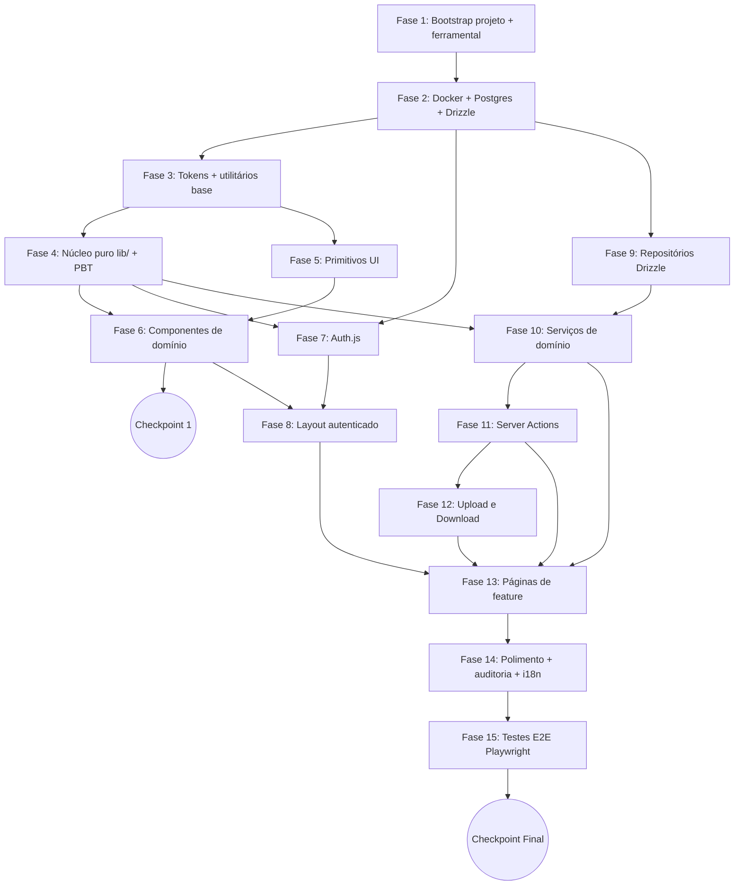

# Implementation Plan: NaveDesk

## Overview

Este plano traduz o design e os 22 requisitos do NaveDesk em uma sequência de tarefas executáveis por um agente de código. A ordenação prioriza **fundação primeiro**: bootstrap do projeto, Docker + Postgres + Drizzle, tokens de design, núcleo puro (`lib/`) coberto por PBT, primitivos de UI e componentes de domínio reutilizáveis. Apenas depois desse alicerce vêm autenticação, layout autenticado, repositórios/serviços e, por fim, as páginas de funcionalidade.

Stack: **Next.js 15 (App Router) + TypeScript estrito**, **PostgreSQL 16 + Drizzle ORM**, **Auth.js v5 (Credentials)**, **Tailwind v4**, **shadcn/ui-style** com `cva`, **Zod** na borda, **fast-check + Vitest** para PBT, **Testcontainers** para integração e **Playwright** para E2E. Tudo orquestrado por **Docker Compose** com migrations e seed idempotente no boot.

## Mapa de Dependências (visão por fase)



## Tasks

- [ ] 1. Fundação do projeto e ferramental
  - [x] 1.1 Inicializar projeto pnpm + Next.js 15 + TypeScript estrito
    - Rodar `pnpm create next-app` com App Router, TypeScript, ESLint
    - Configurar `tsconfig.json` com `strict: true`, `noUncheckedIndexedAccess: true`, paths `@/*` apontando para `src/*`
    - Configurar `next.config.ts` com `output: "standalone"` para Docker
    - _Validates: R17, R18, R20_

  - [x] 1.2 Configurar Tailwind v4
    - Instalar `tailwindcss@^4`, `@tailwindcss/postcss`, `class-variance-authority`, `tailwind-merge`, `clsx`
    - Criar `tailwind.config.ts` registrando `src/**/*.{ts,tsx}`
    - Criar `src/app/globals.css` com diretivas Tailwind v4
    - _Validates: R19_

  - [x] 1.3 Configurar ESLint, Prettier e scripts de qualidade
    - Adicionar `eslint-config-next`, `prettier`, `eslint-config-prettier`
    - Configurar regras estritas para imports, hooks e a11y
    - Adicionar scripts `lint`, `lint:fix`, `format` no `package.json`
    - _Validates: R19_

  - [x] 1.4 Configurar suíte de testes (Vitest, fast-check, Playwright, Testcontainers)
    - Instalar `vitest`, `@vitest/coverage-v8`, `@testing-library/react`, `@testing-library/jest-dom`, `jsdom`, `fast-check`
    - Instalar `@playwright/test`, `testcontainers`, `@testcontainers/postgresql`
    - Criar `vitest.config.ts` com paths e ambiente jsdom
    - Criar `vitest.config.integration.ts` separado (ambiente node) para Testcontainers
    - Criar `playwright.config.ts` apontando para `tests/e2e`
    - Adicionar scripts `test`, `test:pbt`, `test:integration`, `test:e2e`, `test:cov`
    - _Validates: R17, R22_

  - [x] 1.5 Criar estrutura de pastas base do projeto
    - Criar diretórios `src/app/(auth)`, `src/app/(app)`, `src/app/api`
    - Criar `src/components/{ui,domain,layout}`, `src/{actions,services,db,lib,types,styles}`
    - Criar `tests/{unit,pbt,integration,e2e}` e `public/uploads/.gitkeep`
    - Adicionar `.gitignore` cobrindo `node_modules`, `.next`, `.env`, `public/uploads/*` (exceto `.gitkeep`), `coverage`, `playwright-report`
    - _Validates: R18, R19_

- [x] 2. Infraestrutura Docker, Postgres e cliente Drizzle
  - [x] 2.1 Criar Dockerfile multi-stage para Next.js standalone
    - Stages `deps`, `builder`, `runner` com `node:20-alpine`
    - Habilitar `corepack` e usar `pnpm install --frozen-lockfile`
    - Copiar `.next/standalone`, `.next/static`, `public`, `drizzle` no runner
    - Expor porta 3000 e definir `CMD ["node", "server.js"]`
    - _Validates: R18.9_

  - [x] 2.2 Criar `docker-compose.yml` (produção local) e `docker-compose.dev.yml`
    - Serviço `db`: `postgres:16-alpine` com healthcheck `pg_isready`, volume `pgdata`, porta 5432
    - Serviço `app`: build local, `depends_on` com `condition: service_healthy`, volume `uploads`, porta 3000
    - Comando do `app`: `sh -c "pnpm db:migrate && pnpm db:seed:if-empty && node server.js"`
    - Override de dev rodando `pnpm dev` com bind mount do código
    - _Validates: R18.1, R18.3, R17.3_

  - [x] 2.3 Criar `.env.example`, `.dockerignore` e ajustar `.gitignore`
    - `.env.example` com `POSTGRES_USER`, `POSTGRES_PASSWORD`, `POSTGRES_DB`, `DATABASE_URL`, `AUTH_SECRET`, `AUTH_URL`, `UPLOAD_DIR`, `UPLOAD_MAX_BYTES`
    - `.dockerignore` excluindo `node_modules`, `.next`, `.git`, `tests`, `coverage`
    - Confirmar `.env` ignorado pelo Git
    - _Validates: R18.4, R18.5_

  - [x] 2.4 Criar `README.md` com instruções de bootstrap em outra máquina
    - Seção "Como rodar" com no máximo quatro comandos (`git clone`, `cp .env.example .env`, ajuste opcional, `docker compose up --build`)
    - Documentar credenciais do seed (admin/técnico/solicitante)
    - Documentar comandos `pnpm dev`, `pnpm db:migrate`, `pnpm db:seed:if-empty`, `pnpm test`
    - _Validates: R18.8_

  - [x] 2.5 Configurar Drizzle ORM e cliente de banco
    - Instalar `drizzle-orm`, `drizzle-kit`, `pg`, `@types/pg`
    - Criar `drizzle.config.ts` apontando para `src/db/schema.ts` e `out: "src/db/migrations"`
    - Criar `src/db/client.ts` com pool `pg` (`max` configurável via `DATABASE_POOL_MAX`) e instância `drizzle`
    - _Validates: R17.1, R17.5_

- [x] 3. Schema, migrations e seed idempotente
  - [x] 3.1 Definir schema Drizzle completo em `src/db/schema.ts`
    - Enums `roleEnum`, `statusEnum`, `priorityEnum`, `eventTypeEnum`
    - Tabelas: `departments`, `categories`, `slaPolicies`, `users`, `tickets`, `ticketMessages`, `ticketEvents`, `attachments`, `kbCategories`, `kbArticles`
    - Índices em `tickets(status)`, `tickets(assignee_id)`, `tickets(requester_id)`, `tickets(sla_deadline)`, `ticket_messages(ticket_id, created_at)`, `ticket_events(ticket_id, created_at)`
    - _Validates: R17.6, R3, R4, R5, R6, R7, R8, R13, R14, R16_

  - [x] 3.2 Criar migration SQL para sequência `ticket_seq`
    - Adicionar migration manual (ou hook custom) com `CREATE SEQUENCE ticket_seq START 1042 INCREMENT 1`
    - Garantir que `pnpm db:migrate` aplique a sequência junto às tabelas
    - _Validates: R9.5_

  - [x] 3.3 Gerar migration inicial com Drizzle Kit
    - Rodar `pnpm drizzle-kit generate` produzindo arquivos em `src/db/migrations/`
    - Versionar migrations no Git
    - _Validates: R17.2_

  - [x] 3.4 Implementar runner `pnpm db:migrate` idempotente
    - Criar `src/db/migrate.ts` usando `drizzle-orm/node-postgres/migrator`
    - Adicionar script no `package.json` que aplica somente migrations pendentes
    - Falhar com saída clara em erro de conexão
    - _Validates: R17.3, R17.4_

  - [x] 3.5 Implementar seed idempotente `pnpm db:seed:if-empty`
    - Criar `src/db/seed.ts` que checa `SELECT COUNT(*) FROM users` e aborta se > 0
    - Popular departamentos (Fiscal, Contabilidade, TI), categorias padrão (hardware, software, sistema, rede, acesso, email), políticas SLA padrão (baixa=48, media=24, alta=8, critica=2)
    - Criar 3 usuários: `admin@contabilandrade.com.br`, `tecnico@contabilandrade.com.br`, `solicitante@contabilandrade.com.br` com senha `admin123` bcrypt(cost=12)
    - _Validates: R6.1, R14.2, R18.6, R18.7_

  - [x] 3.6 Teste de integração com Testcontainers para migrations e seed
    - Subir Postgres efêmero, rodar `migrate` duas vezes (idempotência), rodar `seed:if-empty` duas vezes (idempotência)
    - Validar contagem de linhas em `users`, `categories`, `sla_policies` após segunda execução
    - _Validates: R17.4, R18.6, R18.7_

- [x] 4. Tokens de design e utilitários compartilhados
  - [x] 4.1 Criar `src/styles/tokens.css` com paleta índigo Tahoe
    - CSS custom properties para superfícies, linhas, ink, accent (`--accent: #5E5CE6`), status (green/amber/red/blue + soft), raios `--r-1..r-5`, `--r-pill`, sombras `--sh-1`, `--sh-2`, `--sh-pop`
    - Variáveis de tipografia `--font` (Geist) e `--font-mono` (Geist Mono) com fallbacks
    - _Validates: R19.1, R21_

  - [x] 4.2 Criar mirror TypeScript em `src/lib/design-tokens.ts`
    - Exportar `tone.status` (aberto→blue, andamento→amber, aguardando→grey, resolvido→green, fechado→grey)
    - Exportar `tone.priority` (baixa→grey, media→blue, alta→amber, critica→red)
    - Exportar mapas de rótulos pt-BR para status, prioridade e ações
    - _Validates: R19.2, R19.5, R19.6, R20.4_

  - [x] 4.3 Configurar layout root e fonte Geist
    - Importar `tokens.css` em `globals.css`
    - Adicionar `lang="pt-BR"` no `<html>` em `src/app/layout.tsx`
    - Carregar Geist via `next/font` (sans + mono) e expor variáveis CSS
    - _Validates: R20.2, R21.2, R21.3_

  - [x] 4.4 Implementar `src/lib/cn.ts` (`clsx` + `tailwind-merge`)
    - Função `cn(...classes)` para mesclar classes Tailwind sem conflito
    - _Validates: R19.8_

  - [x] 4.5 Implementar `src/lib/format.ts` para datas e durações em pt-BR
    - Funções `fmtDate`, `fmtDateTime`, `relTime`, `fmtDuration` usando `date-fns/locale/pt-BR`
    - Funções puras e determinísticas dado um `now` injetado
    - _Validates: R20.3_

  - [x] 4.6 Implementar `src/lib/constants.ts`
    - Exportar listas tipadas `PRIORITIES`, `STATUSES`, `EVENT_TYPES`, `ROLES`
    - Exportar rótulos pt-BR oficiais (`Aberto`, `Em andamento`, `Aguardando solicitante`, `Resolvido`, `Fechado`, `Baixa`, `Média`, `Alta`, `Crítica`)
    - _Validates: R20.4_

  - [x] 4.7 Definir tipos de domínio em `src/types/domain.ts`
    - Tipos `Role`, `Priority`, `TicketStatus`, `TicketAction`, `Ticket`, `SessionUser`, `SlaPolicy`, `SlaInfo`, `ActionResult<T>`
    - _Validates: R2, R3, R4, R6, R22_

  - [x] 4.8 Testes unitários para `format.ts`
    - Cobrir `fmtDate`, `relTime`, `fmtDuration` com locale pt-BR (mês, dias, "há 2 horas")
    - _Validates: R20.3_

- [x] 5. Núcleo puro: schemas Zod compartilhados
  - [x] 5.1 Implementar `src/lib/schemas.ts`
    - `CreateTicketSchema`, `UpdateTicketSchema`, `PostMessageSchema`, `CreateUserSchema`, `UpdateSlaPolicySchema`, `CreateCategorySchema`, `CreateKbArticleSchema`
    - Constante `UploadConstraints` com `maxBytes` e `allowedMime`
    - _Validates: R3.1, R3.2, R7.1, R8.2, R8.3, R13.4, R14.2, R15.2_

  - [x] 5.2 Testes unitários para schemas Zod
    - Casos válidos e inválidos (limites min/max, tipos errados, defaults)
    - _Validates: R3.2, R7.1_

- [x] 6. Núcleo puro: cálculo de SLA
  - [x] 6.1 Implementar `src/lib/sla.ts`
    - `computeSlaDeadline(now, priority, policies): Date` puro
    - `computeSlaInfo(deadline, priority, policies, now): SlaInfo` com `level ∈ {ok, warn, crit, breached}`, `remainingMs`, `pctElapsed`
    - _Validates: R6.2, R6.3, R6.4, R6.5, R6.6, R6.7, R6.9_

  - [x] 6.2 PBT - Property 1: SLA determinístico
    - **Property 1: `computeSlaDeadline` é determinístico e respeita horas da política**
    - Usar `fast-check` para gerar `(now, priority, hours)` e assertar `d.getTime() === now.getTime() + hours * 3_600_000`
    - **Validates: R6.2, R6.9**

  - [x] 6.3 PBT - Property 2: SLA monotônico no tempo
    - **Property 2: `remainingMs` decresce estritamente conforme `now` avança**
    - **Validates: R6.3**

  - [x] 6.4 PBT - Property 3: SLA breached é absorvente
    - **Property 3: para `now ≥ deadline`, `level === "breached"`**
    - **Validates: R6.7**

  - [x] 6.5 Testes unitários de fronteira para `computeSlaInfo`
    - Limiares 25% (warn), 10% (crit), 0% (breached) e clamping de `pctElapsed`
    - _Validates: R6.4, R6.5, R6.6_

- [x] 7. Núcleo puro: máquina de estados de tickets
  - [x] 7.1 Implementar `src/lib/ticket-state.ts`
    - Função `transitionTicketStatus(current, action): TicketStatus` com a tabela do design
    - Classe `IllegalStateTransitionError` com `current` e `action`
    - Helper `deriveAction(currentStatus, nextStatus): TicketAction`
    - _Validates: R4.1, R4.2, R4.3, R4.4, R4.5, R4.6, R4.7, R4.8, R4.9_

  - [x] 7.2 PBT - Property 4: transição é total no domínio válido
    - **Property 4: para todo `(status, action)` aceito, retorna `TicketStatus`; para os marcados `—`, lança `IllegalStateTransitionError`**
    - **Validates: R4.8, R4.9**

  - [x] 7.3 PBT - Property 5: transição idempotente quando aplicável
    - **Property 5: `transitionTicketStatus(s, a) === s` quando `(s, a)` não muda estado**
    - **Validates: R4.9_

  - [x] 7.4 PBT - Property 6: `fechado` é absorvente
    - **Property 6: para `a ∉ {REOPEN, CLOSE}`, `transitionTicketStatus("fechado", a)` lança `IllegalStateTransitionError`**
    - **Validates: R4.8**

- [x] 8. Núcleo puro: geração de identificadores `NVD-XXXX`
  - [x] 8.1 Implementar `src/lib/ticket-id.ts`
    - Função `nextTicketId(prefix: string, db): Promise<string>` chamando `SELECT nextval('ticket_seq')`
    - Validar `prefix` contra `/^[A-Z]{2,4}$/`
    - _Validates: R9.1, R9.2, R9.5_

  - [x] 8.2 Testes unitários com mock de sequência
    - Mock retorna inteiros sequenciais; assertar formato `NVD-{n}` e validação do prefixo
    - _Validates: R9.1_

  - [x] 8.3 PBT - Property 7 e 8 com Testcontainers
    - **Property 7: chamadas sequenciais produzem inteiros estritamente crescentes**
    - **Property 8: N chamadas concorrentes (Promise.all) produzem N IDs distintos**
    - **Validates: R9.3, R9.4**

- [x] 9. Núcleo puro: políticas RBAC
  - [x] 9.1 Implementar `src/lib/policies.ts`
    - Funções puras: `canCreateTicket`, `canViewTicket`, `canChangeStatus`, `canChangePriority`, `canAssignSelf`, `canAssignOthers`, `canPostInternalNote`, `canReadAttachment`, `canRateTicket`, `canManageUsers`, `canManageSla`, `canManageCategories`, `canCreateKbArticle`
    - Implementação seguindo regras do design (admin > tecnico > solicitante)
    - _Validates: R2, R5.1, R5.6, R7.3, R8.7, R12.7, R13.9, R14_

  - [x] 9.2 Testes unitários para todas as policies
    - Matriz `(role, ação, recurso) → boolean` cobrindo cenários positivos e negativos
    - _Validates: R2.1, R2.2, R2.3, R2.4_

  - [x] 9.3 PBT - Property 9: RBAC consistente com status
    - **Property 9: `canChangeStatus(u, t, t.status) === true` para qualquer `u` que enxergue `t`, exceto status `fechado`**
    - **Validates: R2, R12_

- [x] 10. Primitivos de UI (`src/components/ui/`)
  - [x] 10.1 Implementar `Button` com variantes `primary | default | ghost | danger` e tamanhos `sm | md | lg | icon`
    - Usar `cva` para variantes; suportar `asChild`, `loading`, `icon`
    - _Validates: R19.3, R19.8_

  - [x] 10.2 Implementar `Input` e `Textarea`
    - Estados `error`, `disabled`, `readonly`; suporte a `aria-invalid` e `aria-describedby`
    - _Validates: R19.3_

  - [x] 10.3 Implementar `Select` baseado em `@radix-ui/react-select`
    - _Validates: R19.3_

  - [x] 10.4 Implementar `Badge` com `tone: indigo|blue|green|amber|red|grey` e `withDot`
    - _Validates: R19.3_

  - [x] 10.5 Implementar `Card` (header, body, footer)
    - _Validates: R19.3_

  - [x] 10.6 Implementar `Dialog` baseado em `@radix-ui/react-dialog`
    - _Validates: R19.3_

  - [x] 10.7 Implementar `Dropdown` baseado em `@radix-ui/react-dropdown-menu`
    - _Validates: R19.3_

  - [x] 10.8 Implementar `Tabs` baseado em `@radix-ui/react-tabs`
    - _Validates: R19.3_

  - [x] 10.9 Implementar `Toast` baseado em `@radix-ui/react-toast`
    - Provider global em `app/layout.tsx`
    - _Validates: R19.3, R22_

  - [x] 10.10 Implementar `Avatar` com cor de fundo derivada de `avatarColor`
    - _Validates: R19.3_

  - [x] 10.11 Implementar `DataTable` genérico tipado
    - Props `columns`, `rows`, `rowKey`, `onRowClick`, `empty`, `loading`
    - Cabeçalho clicável para `sortKey`
    - _Validates: R11.5, R19.3_

  - [x] 10.12 Implementar `EmptyState` e `Kbd`
    - _Validates: R19.3_

  - [x] 10.13 Testes unitários de render para primitivos
    - Snapshot e a11y básicos (role, aria) para `Button`, `Badge`, `Dialog`
    - _Validates: R19.3_

- [x] 11. Componentes de domínio (`src/components/domain/`)
  - [x] 11.1 Implementar `StatusBadge` mapeando status → tom via `design-tokens.tone.status`
    - Usa `Badge`; rótulo pt-BR vindo de `constants`
    - _Validates: R19.4, R19.5, R20.4_

  - [x] 11.2 Implementar `PriorityPill` mapeando prioridade → tom via `design-tokens.tone.priority`
    - _Validates: R19.4, R19.6, R20.4_

  - [x] 11.3 Implementar `CategoryChip` exibindo ícone Lucide + rótulo
    - _Validates: R19.4_

  - [x] 11.4 Implementar `SlaMeter` (client component) com `setInterval` 1s
    - Re-renderiza apenas quando `level` muda
    - Mostra "—" se `status ∈ {resolvido, fechado}`
    - Consome `computeSlaInfo` puro
    - _Validates: R6.8, R19.4_

  - [x] 11.5 Implementar `KpiCard`
    - Props `label`, `value`, `unit`, `delta`, `spark`
    - _Validates: R10.1, R19.4_

  - [x] 11.6 Implementar `TicketRow` (linha da `DataTable`)
    - Compõe `StatusBadge`, `PriorityPill`, `CategoryChip`, `SlaMeter`
    - _Validates: R11, R19.4, R19.7_

  - [x] 11.7 Implementar `AttachmentChip`
    - Mostra nome, tamanho formatado e ícone por MIME
    - _Validates: R8, R19.4_

  - [x] 11.8 Testes unitários para componentes de domínio
    - Mapeamentos status/prioridade → tom corretos; render sem fetch
    - _Validates: R19.5, R19.6, R19.7_

- [ ] 12. Checkpoint 1 — fundação consolidada
  - Garantir que `pnpm lint`, `pnpm typecheck`, `pnpm test` e `pnpm build` passem
  - Garantir que `docker compose up --build` sobe app e Postgres com migrations e seed aplicados
  - Validar acesso a `http://localhost:3000` (mesmo que ainda redirecione para `/login`)
  - Ensure all tests pass, ask the user if questions arise.

- [x] 13. Autenticação com Auth.js v5
  - [x] 13.1 Configurar `src/lib/auth.ts` com Credentials provider e JWT
    - Strategy `jwt`, cookie HttpOnly + SameSite=Lax + Secure em produção
    - Sessão expõe `{ id, email, name, role, departmentId }`
    - Helper `auth()` para Server Components
    - _Validates: R1.4, R1.6, R1.7_

  - [x] 13.2 Implementar `verifyPassword` em `services/users.service.ts`
    - `bcrypt.compare` contra `users.password_hash`; rejeitar se `active=false`
    - Mensagem de erro genérica (não revela existência do email)
    - _Validates: R1.2, R1.3, R1.5, R14.5_

  - [x] 13.3 Criar route handler `src/app/api/auth/[...nextauth]/route.ts`
    - _Validates: R1_

  - [x] 13.4 Implementar middleware de autorização `src/middleware.ts`
    - Redireciona não-autenticados de `/(app)/*` para `/login?next=...`
    - Bloqueia `/admin/*` para não-admins (403 ou redirect `/dashboard`)
    - _Validates: R1.1, R1.7, R2.8_

  - [x] 13.5 Implementar página `/login`
    - Form `react-hook-form` + Zod, mensagem de erro genérica em pt-BR
    - Respeita parâmetro `next` no redirect pós-login
    - _Validates: R1.1, R1.4, R20.1_

  - [x] 13.6 Implementar action de logout
    - Server Action que invalida cookie e redireciona para `/login`
    - _Validates: R1.8_

  - [x] 13.7 Implementar rate limit de login (10 req/min/IP)
    - Middleware in-memory para dev (LRU/Map) com hook para troca por `@upstash/ratelimit`
    - _Validates: R1.9_

  - [x] 13.8 Teste de integração de auth com Testcontainers
    - Login válido, login com `active=false`, login com senha errada, rate limit ao exceder 10/min
    - _Validates: R1.2, R1.3, R1.5, R1.9_

- [x] 14. Layout autenticado
  - [x] 14.1 Implementar `Sidebar` (`components/layout/sidebar.tsx`)
    - Links contextuais por papel; contadores `open`, `assigned`, `unassigned`
    - Item ativo destacado conforme rota corrente
    - _Validates: R2.7, R10, R11_

  - [x] 14.2 Implementar `Topbar` (`components/layout/topbar.tsx`)
    - Avatar com menu (perfil, logout); título e subtítulo da página
    - _Validates: R1.8_

  - [x] 14.3 Implementar `PageHeader` (`components/layout/page-header.tsx`)
    - _Validates: R19.4_

  - [x] 14.4 Implementar `src/app/(app)/layout.tsx`
    - Verifica sessão via `auth()`, monta Sidebar + Topbar, slot `<main>`
    - _Validates: R1, R2_

- [x] 15. Repositórios Drizzle (`src/db/repositories/`)
  - [x] 15.1 Implementar `tickets.repo.ts`
    - `insertTicket`, `updateTicket`, `findTicketById`, `findVisibleForUser` (aplica filtro RBAC no SQL para solicitantes), `listWithFilters` (cursor-based)
    - _Validates: R3.5, R10, R11.1, R11.4, R12.7_

  - [x] 15.2 Implementar `users.repo.ts`
    - `findByEmail`, `findById`, `listAll`, `insertUser`, `updateUserActive`, `updateUserRole`
    - _Validates: R14_

  - [x] 15.3 Implementar `kb.repo.ts`
    - `listArticles` com filtro `published`, busca textual usando `tsvector` ou `ILIKE`, `findBySlug`, `insertArticle`, `incrementViews` atômico
    - _Validates: R13_

  - [x] 15.4 Implementar `messages.repo.ts` e `events.repo.ts`
    - `insertMessage`, `listMessagesForTicket(scopedByRole)`, `insertEvent`, `listEventsForTicket`, `recentActivity(limit)`
    - _Validates: R7.4, R7.5, R7.8, R10.4, R16_

  - [x] 15.5 Implementar `attachments.repo.ts`
    - `insertAttachment`, `findById`, `linkToTicket`, `linkToMessage`
    - _Validates: R8.6_

- [x] 16. Camada de serviços de domínio
  - [x] 16.1 Implementar `services/tickets.service.ts` — criação
    - `createTicket(actor, input)` orquestrando validação Zod, `canCreateTicket`, `computeSlaDeadline`, `nextTicketId`, INSERT em transação com evento `created` e linkagem de anexos
    - _Validates: R3.1, R3.3, R3.4, R3.5, R3.6, R6.2, R9, R16.1_

  - [x] 16.2 Implementar `tickets.service.ts` — mudança de status, prioridade, atribuição
    - `changeTicketStatus`, `changeTicketPriority`, `assignTicket`, `assignTicketToMe`, `unassignTicket`, `rateTicket`
    - Cada operação valida via `policies` + `transitionTicketStatus` + grava evento correspondente em transação
    - Atribui `resolvedAt`/`closedAt` quando aplicável
    - _Validates: R4.10, R4.11, R4.12, R5, R12.4, R12.6, R16.2-R16.7_

  - [x] 16.3 Implementar `services/messages.service.ts`
    - `postMessage(actor, ticketId, body, isInternal)` com policy `canPostInternalNote`
    - `listMessagesForUser(user, ticketId)` filtrando notas internas para solicitantes
    - _Validates: R7_

  - [x] 16.4 Implementar `services/users.service.ts`
    - `createUser`, `deactivateUser`, `updateRole`; bcrypt(cost=12) na senha
    - Conflito de email retorna `ActionResult.error.code="CONFLICT"`
    - _Validates: R14_

  - [x] 16.5 Implementar `services/kb.service.ts`
    - `listArticles`, `getArticle` (incrementa views), `createArticle` (slug único), `searchArticles`, `suggestForTitle(text, limit=5)`
    - Renderização com `react-markdown` + `rehype-sanitize`
    - _Validates: R13_

  - [x] 16.6 Implementar `services/stats.service.ts` (KPIs do dashboard)
    - `getDashboardKpis(user)` retornando contagens, distribuição por prioridade/categoria e feed de atividades; escopa por requesterId quando solicitante
    - _Validates: R10_

  - [x] 16.7 Implementar `services/admin.service.ts`
    - `updateSlaPolicy(priority, hours)` (preserva deadlines existentes, invalida cache TTL 60s)
    - `createCategory`, `deactivateCategory`, `deleteCategory` (rejeita se houver tickets associados)
    - _Validates: R6.10, R15_

  - [x] 16.8 Implementar cache TTL 60s para leituras estáveis
    - Helper `src/lib/cache.ts` em memória com invalidação manual
    - Aplicar em `getAllSlaPolicies`, `listCategories`, `listDepartments`
    - _Validates: R15.3_

  - [x] 16.9 PBT - Property 10: solicitante só vê os próprios tickets
    - **Property 10: para `u.role="solicitante"`, todo ticket retornado por `listVisibleForUser(u)` satisfaz `t.requesterId === u.id`**
    - **Validates: R2.4, R11.4**

  - [x] 16.10 PBT - Property 12: conservação de mensagens
    - **Property 12: após `postMessage`, `count(messages where ticketId=X) = count_anterior + 1` e a mais recente é a inserida**
    - Executar contra Postgres via Testcontainers
    - **Validates: R7.1, R7.7**

  - [x] 16.11 Testes de integração com Testcontainers para `tickets.service`
    - Fluxos: create + assign + status changes + close + audit trail; rejeição RBAC; transação rollback em falha
    - _Validates: R3, R4, R5, R16_

- [x] 17. Server Actions
  - [x] 17.1 Implementar `src/actions/tickets.ts`
    - `createTicket`, `updateTicket`, `changeTicketStatus`, `assignTicket`, `assignTicketToMe`, `rateTicket`
    - Cada action: parse Zod, chama service, retorna `ActionResult`, `revalidatePath` em sucesso
    - _Validates: R3.7, R12.8, R22.1_

  - [x] 17.2 Implementar `src/actions/messages.ts`
    - `postMessage(ticketId, body, isInternal)` com revalidação da página do ticket
    - _Validates: R7.7_

  - [x] 17.3 Implementar `src/actions/admin.ts`
    - `createUser`, `deactivateUser`, `updateUserRole`, `updateSlaPolicy`, `createCategory`, `deactivateCategory`
    - _Validates: R14, R15_

  - [x] 17.4 Implementar `src/actions/kb.ts`
    - `createArticle`, `publishArticle`, `incrementViewsAction`
    - _Validates: R13_

- [x] 18. Upload e download de anexos
  - [x] 18.1 Implementar abstração `src/lib/storage.ts`
    - Interface `StorageService` com `put(key, buffer)`, `get(key)`, `delete(key)`
    - Implementação local `LocalDiskStorage` em `public/uploads/{yyyy}/{mm}/{uuid}.{ext}`
    - _Validates: R8.5_

  - [x] 18.2 Implementar `POST /api/uploads`
    - Autenticação obrigatória, parse `multipart/form-data`
    - Validar tamanho (≤25 MiB) e MIME declarado (allowlist)
    - Validar magic bytes via `file-type`; rejeitar se divergir
    - Persistir via `StorageService` e gravar `attachments`
    - Retornar `{ id, url, name, size, mime }`
    - _Validates: R8.1, R8.2, R8.3, R8.4, R8.5, R8.6, R22.4_

  - [x] 18.3 Implementar `GET /api/uploads/[id]`
    - Verificar `policies.canReadAttachment`; retornar 404 se negado
    - `Content-Disposition: attachment` para tipos não-imagem
    - _Validates: R8.7, R8.8, R22.6_

  - [x] 18.4 Implementar rate limit de uploads (30/min/usuário)
    - _Validates: R8.9_

  - [x] 18.5 PBT - Property 11: validação de upload
    - **Property 11: arquivo aceito sempre satisfaz `mime ∈ allowedMime ∧ size ≤ maxBytes`**
    - **Validates: R8.2, R8.3**

  - [x] 18.6 Testes de integração para upload e download
    - Tamanho excedido → 413; MIME inválido → 415; magic bytes divergentes → 415; 404 sem permissão
    - _Validates: R8, R22.4, R22.6_

- [x] 19. Página `/dashboard`
  - [x] 19.1 Implementar `src/app/(app)/dashboard/page.tsx` (Server Component)
    - Consome `stats.service.getDashboardKpis(user)`; monta grade de `KpiCard`, distribuição por prioridade/categoria, feed de atividades
    - Escopa por papel (solicitante vê só os seus)
    - _Validates: R10.1, R10.2, R10.3, R10.4, R10.6, R10.7_

  - [x] 19.2 Implementar componente cliente `SlaAlertBanner`
    - Exibe alerta quando há tickets com `level ∈ {breached, crit}`
    - _Validates: R10.5_

- [x] 20. Página `/tickets` (lista com filtros)
  - [x] 20.1 Implementar `src/app/(app)/tickets/page.tsx` (Server Component)
    - Consome `tickets.service.listVisibleForUser(user, filters)` com paginação cursor `(updated_at, id)`
    - Filtros via query string: `status`, `priority`, `categoryId`, `departmentId`, `assigneeId` (incluindo `me`), `requesterId`, `q`
    - Ordenação default `updated_at DESC`; alternativas `createdAt`, `priority`, `slaDeadline`
    - Solicitante: filtro `requesterId = user.id` aplicado implicitamente
    - _Validates: R11.1, R11.2, R11.3, R11.4, R11.5_

  - [x] 20.2 Implementar componente cliente `TicketsFilterBar`
    - Atualiza query string sem reload (`useRouter`)
    - _Validates: R11.2_

  - [x] 20.3 Implementar action `exportTickets` (CSV/XLSX)
    - Gera arquivo respeitando filtros e escopo do solicitante
    - Colunas: `id, title, status, priority, category, department, requester, assignee, createdAt, slaDeadline, resolvedAt`
    - _Validates: R11.6, R11.7_

- [x] 21. Página `/tickets/novo`
  - [x] 21.1 Implementar `ticket-form.tsx` em `components/domain/`
    - `react-hook-form` + Zod; campos title, description, categoryId, departmentId, priority, attachments
    - Suporte a `allowAssign` (técnico/admin podem pré-atribuir)
    - Upload incremental via `/api/uploads`
    - _Validates: R3.1, R3.2, R3.8, R8_

  - [x] 21.2 Implementar `src/app/(app)/tickets/novo/page.tsx`
    - Chama `createTicket` action; redireciona para `/tickets/{id}` em sucesso
    - _Validates: R3.7_

  - [x] 21.3 Implementar sugestão KB ao digitar título
    - Componente cliente debounced que chama `kb.service.suggestForTitle`
    - Lista até 5 artigos publicados relevantes
    - _Validates: R13.8_

- [x] 22. Página `/tickets/[id]` (detalhe)
  - [x] 22.1 Implementar `src/app/(app)/tickets/[id]/page.tsx` (Server Component)
    - Carrega ticket via service (404 se sem permissão), monta cabeçalho com dados completos e `SlaMeter`
    - _Validates: R12.1, R12.7_

  - [x] 22.2 Implementar `ticket-conversation.tsx`
    - Lista mensagens (escopadas por papel), markdown sanitizado
    - Form para postar mensagem; toggle de nota interna apenas para tecnico/admin
    - _Validates: R7.4, R7.5, R7.6, R7.8, R12.2_

  - [x] 22.3 Implementar `ticket-history.tsx`
    - Lista cronológica de `ticket_events` com rótulos pt-BR
    - _Validates: R12.2, R16.9_

  - [x] 22.4 Implementar painel de controles laterais
    - Mudança de status, prioridade, atribuição (visíveis conforme RBAC)
    - Solicitante: confirmar fechamento + avaliação 1..5 estrelas em status `resolvido`
    - Revalida página após cada mutação
    - _Validates: R12.3, R12.4, R12.5, R12.6, R12.8_

- [x] 23. Página `/tickets/atribuidos`
  - [x] 23.1 Implementar `src/app/(app)/tickets/atribuidos/page.tsx`
    - Lista tickets com `assigneeId = user.id` reaproveitando `TicketsTable`
    - Bloqueia acesso para solicitante
    - _Validates: R5.7_

- [x] 24. Páginas de Base de Conhecimento (KB)
  - [x] 24.1 Implementar `src/app/(app)/kb/page.tsx`
    - Lista categorias e artigos publicados; tecnico/admin vê também rascunhos próprios
    - Campo de busca textual
    - _Validates: R13.1, R13.2, R13.3_

  - [x] 24.2 Implementar `src/app/(app)/kb/[slug]/page.tsx`
    - Renderiza markdown sanitizado; incrementa views ao carregar (Server Action atômica)
    - _Validates: R13.6, R13.7_

  - [x] 24.3 Implementar `src/app/(app)/kb/novo/page.tsx`
    - Form para tecnico/admin (solicitante recebe 403 via middleware/policy)
    - Validação de slug único; toggle `published`
    - _Validates: R13.4, R13.5, R13.9_

- [x] 25. Páginas administrativas (admin)
  - [x] 25.1 Implementar `src/app/(app)/admin/usuarios/page.tsx`
    - Lista usuários, ações criar/desativar/alterar papel via `admin` actions
    - Conflito de email → toast de erro
    - _Validates: R14_

  - [x] 25.2 Implementar `src/app/(app)/admin/sla/page.tsx`
    - Form para horas por prioridade; aceita inteiros > 0; invalida cache no save
    - _Validates: R15.1, R15.2, R15.3_

  - [x] 25.3 Implementar `src/app/(app)/admin/categorias/page.tsx`
    - CRUD com criação, desativação e tentativa de exclusão (rejeitada se houver tickets)
    - _Validates: R15.4, R15.5, R15.6, R15.7_

  - [x] 25.4 Implementar `src/app/(app)/admin/geral/page.tsx`
    - Configurações gerais (placeholder com pelo menos branding e timezone)
    - _Validates: R21_

- [x] 26. Página `/perfil`
  - [x] 26.1 Implementar `src/app/(app)/perfil/page.tsx`
    - Dados do usuário (nome, email, papel, departamento, cor do avatar) e troca de senha
    - _Validates: R1.6_

- [ ] 27. Polimento, auditoria e i18n pt-BR
  - [x] 27.1 Auditoria — revisão completa da trilha
    - Garantir que todas as mutations (create, status_changed, priority_changed, assigned, unassigned, rated, closed) gravam evento na mesma transação
    - Adicionar testes de integração para cada tipo de evento
    - _Validates: R16_

  - [x] 27.2 Mensagens de erro padronizadas em pt-BR
    - Mapear `code → mensagem amigável` em `src/lib/error-messages.ts`
    - Toasts e UI consomem o mapa
    - _Validates: R20.1, R22.1, R22.2, R22.3_

  - [x] 27.3 Verificar respostas HTTP padronizadas (413, 415, 404, 403, 500)
    - Garantir que 500 não vaza stack trace; logs estruturados com correlação
    - _Validates: R22.4, R22.5, R22.6, R22.7_

  - [ ] 27.4 Aplicar fonte Geist e validar paleta em todas as páginas
    - Verificar fallback para `ui-sans-serif` quando Geist falhar
    - _Validates: R21.1, R21.2, R21.3, R21.4, R21.5_

  - [ ] 27.5 Verificação final de a11y básica
    - Rodar `axe` em rotas principais (login, dashboard, tickets, detalhe, kb)
    - _Validates: R19_

- [ ] 28. Testes E2E com Playwright
  - [ ] 28.1 E2E — login com cada papel e dashboard correspondente
    - admin, tecnico, solicitante; valida sidebar e KPIs distintos
    - _Validates: R1, R10_

  - [ ] 28.2 E2E — solicitante abre ticket → recebe resposta → confirma fechamento → avalia
    - Cobre criação, conversa, mudança de status, rating
    - _Validates: R3, R7, R12_

  - [ ] 28.3 E2E — técnico assume ticket, muda prioridade, resolve
    - Valida transições e trilha de auditoria visível no histórico
    - _Validates: R4, R5, R16_

  - [ ] 28.4 E2E — admin cria usuário, desativa, ajusta SLA, cria/desativa categoria
    - _Validates: R14, R15_

  - [ ] 28.5 E2E — upload e download de anexo (≤25 MiB)
    - Inclui rejeição de tipo não permitido (415) e excesso de tamanho (413)
    - _Validates: R8_

  - [ ] 28.6 E2E — busca e visualização de KB com incremento de views
    - _Validates: R13_

- [ ] 29. Checkpoint Final
  - Garantir que `pnpm test`, `pnpm test:integration`, `pnpm test:e2e` e `pnpm build` estão verdes
  - Validar `docker compose down -v && docker compose up --build` em máquina limpa: migrations + seed + login admin funciona
  - Atualizar README com qualquer ajuste descoberto
  - Ensure all tests pass, ask the user if questions arise.

## Notes

- Tarefas marcadas com `*` são opcionais (testes) e podem ser puladas para um MVP mais rápido, mas são fortemente recomendadas para o núcleo puro (`lib/sla`, `lib/ticket-state`, `lib/ticket-id`, `lib/policies`) onde o PBT garante correção formal.
- Cada tarefa referencia requisitos específicos para rastreabilidade (`Validates: Rx.y`).
- Os checkpoints (12, 29) servem como portões de qualidade — não avance sem build, lint e testes verdes.
- Property tests (PBT) usam `fast-check` para gerar inputs aleatórios sobre as 12 propriedades documentadas no design.
- Testes de integração usam `Testcontainers` para subir Postgres real e validar concorrência em `nextTicketId` e a transacionalidade dos serviços.
- Componentes de domínio nunca fazem fetch direto: todos os dados chegam via props para serem compatíveis com Server Components.
- Mudanças de paleta ou rótulos devem ser feitas em um único lugar (`tokens.css` + `design-tokens.ts` + `constants.ts`).

## Task Dependency Graph

```json
{
  "waves": [
    { "id": 0, "tasks": ["1.1"] },
    { "id": 1, "tasks": ["1.2", "1.3", "1.4", "1.5"] },
    { "id": 2, "tasks": ["2.1", "2.3", "2.5"] },
    { "id": 3, "tasks": ["2.2", "2.4", "3.1"] },
    { "id": 4, "tasks": ["3.2", "4.1", "4.6", "4.7"] },
    { "id": 5, "tasks": ["3.3", "4.2", "4.3", "4.4", "4.5", "5.1"] },
    { "id": 6, "tasks": ["3.4", "4.8", "5.2", "6.1", "7.1", "9.1"] },
    { "id": 7, "tasks": ["3.5", "6.2", "6.3", "6.4", "6.5", "7.2", "7.3", "7.4", "8.1", "9.2", "9.3", "10.1", "10.2", "10.3", "10.4", "10.5", "10.6", "10.7", "10.8", "10.9", "10.10", "10.11", "10.12"] },
    { "id": 8, "tasks": ["3.6", "8.2", "8.3", "10.13", "11.1", "11.2", "11.3", "11.4", "11.5", "11.6", "11.7"] },
    { "id": 9, "tasks": ["11.8", "13.1", "13.2", "15.1", "15.2", "15.3", "15.4", "15.5", "18.1"] },
    { "id": 10, "tasks": ["13.3", "13.4", "13.6", "13.7", "14.1", "14.2", "14.3", "16.1", "16.2", "16.3", "16.4", "16.5", "16.6", "16.7", "16.8"] },
    { "id": 11, "tasks": ["13.5", "13.8", "14.4", "16.9", "16.10", "16.11", "17.1", "17.2", "17.3", "17.4", "18.2", "18.3", "18.4"] },
    { "id": 12, "tasks": ["18.5", "18.6", "19.1", "20.1", "21.1", "22.1", "23.1", "24.1", "25.1", "25.2", "25.3", "25.4", "26.1"] },
    { "id": 13, "tasks": ["19.2", "20.2", "20.3", "21.2", "22.2", "22.3", "24.2", "24.3"] },
    { "id": 14, "tasks": ["21.3", "22.4"] },
    { "id": 15, "tasks": ["27.1", "27.2", "27.3", "27.4", "27.5"] },
    { "id": 16, "tasks": ["28.1", "28.2", "28.3", "28.4", "28.5", "28.6"] }
  ]
}
```
